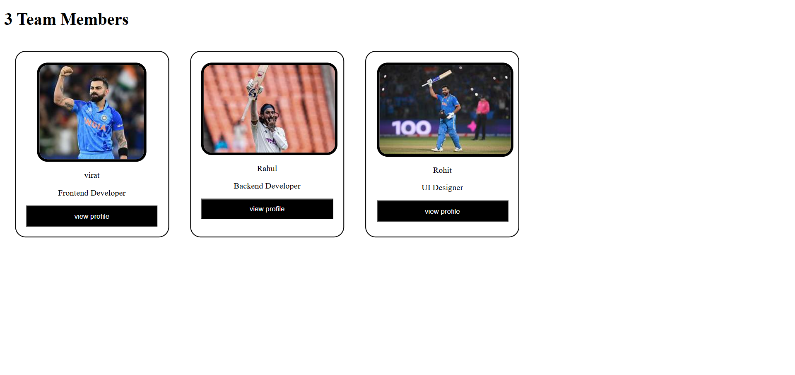

# Day 07 - Grid Gallery

## 📌 Project Overview

This is my Day 07 project in the HTML & CSS learning journey.

I created a Grid Gallery using HTML and CSS. The project displays multiple boxes arranged in a grid layout to practice CSS Grid concepts.

## 🚀 Technologies Used

* HTML5
* CSS3
* CSS Grid

## 📚 Concepts Practiced

* display: grid
* grid-template-columns
* repeat()
* gap
* Grid Layout Design

## ✨ Features

* 6 Grid Items
* 3 Column Layout
* Equal Spacing Between Items
* Clean Design
* Responsive Structure

## 📷 Project Screenshot

## 📂 Project Structure

Day-07-Grid-Gallery

├── index.html

├── style.css

├── Screenshot3.png

└── README.md

## 💡 What I Learned

Through this project, I learned how to:

* Create layouts using CSS Grid
* Use grid-template-columns
* Use repeat() for columns
* Add spacing using gap
* Arrange items in rows and columns

## 🎯 Learning Progress

✅ Day 01 - Profile Card

✅ Day 02 - Hover Card

✅ Day 03 - Flexbox Boxes

✅ Day 04 - Flexbox Navbar

✅ Day 05 - Pet Adoption Page

✅ Day 06 - Pricing Cards

✅ Day 07 - Grid Gallery

## 🔥 Challenge Goal

My goal is to become confident in HTML and CSS by building projects and understanding layouts using Flexbox and Grid.

### Day 07 Completed ✅
