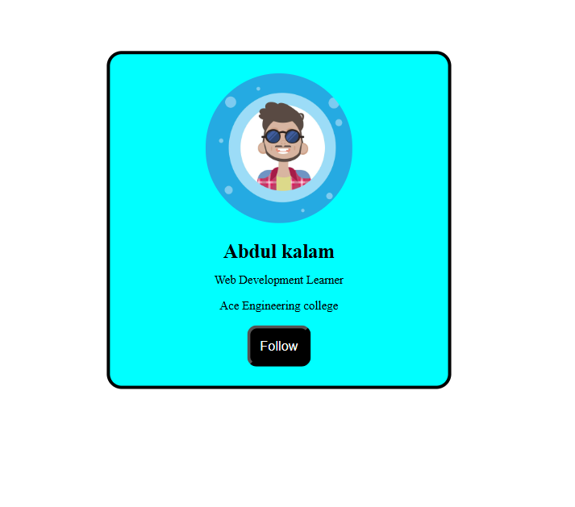

# Day 01 - Profile Card Project

## 📌 Project Overview

This is my Day 01 project in the **100 Days Web Development Challenge**.

I created a simple Profile Card using HTML and CSS.

## 🚀 Technologies Used

- HTML5
- CSS3

## 📚 Concepts Practiced

- Height & Width
- Border
- Border Radius
- Padding
- Margin
- Colors
- Image Styling
- Center Alignment

## 🎯 Features

- Circular Profile Image
- Styled Profile Card
- Custom Background Color
- Follow Button

## 📷 Project Screenshot



## 📂 Project Structure

```text
Day-01-Profile-Card
├── index.html
├── style.css
├── man.jpg
├── Screenshot.png
└── README.md
```

## 💡 What I Learned

Through this project, I learned how to use the CSS Box Model, style images, work with spacing using padding and margin, and create a simple card layout.

## 🔥 100 Days Web Development Challenge

This project is part of my journey to improve my Web Development skills by building projects every day and uploading them to GitHub.

### Day 01 Completed ✅