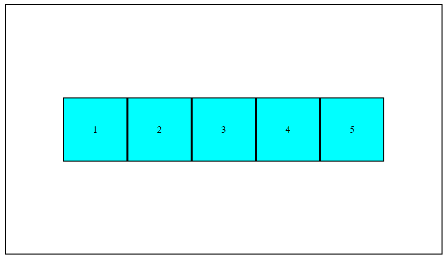

# Day 03 - Flexbox Boxes

## 📌 Project Overview

This is my Day 03 project in the **100 Days Web Development Challenge**.

I created a Flexbox layout using HTML and CSS to understand how Flexbox helps arrange and align elements efficiently.

## 🚀 Technologies Used

* HTML5
* CSS3
* Flexbox

## 📚 Concepts Practiced

* display: flex
* justify-content
* align-items
* flex-direction
* flex-wrap
* Nested Flexbox

## ✨ Features

* Centered Flex Container
* Multiple Flex Items
* Horizontally Aligned Boxes
* Vertically Centered Content
* Responsive Wrapping of Items

## 📷 Project Screenshot

## 📂 Project Structure

Day-03-Flexbox-Boxes

├── index.html

├── style.css

├── screenshot.png

└── README.md

## 💡 What I Learned

Through this project, I learned how to use Flexbox to arrange elements, center content both horizontally and vertically, and create responsive layouts.

## 🎯 Challenge Progress

✅ Day 01 - Profile Card

✅ Day 02 - Hover Card

✅ Day 03 - Flexbox Boxes

## 🔥 100 Days Web Development Challenge

I am building projects daily to improve my Web Development skills and strengthen my front-end development fundamentals.

### Day 03 Completed ✅

