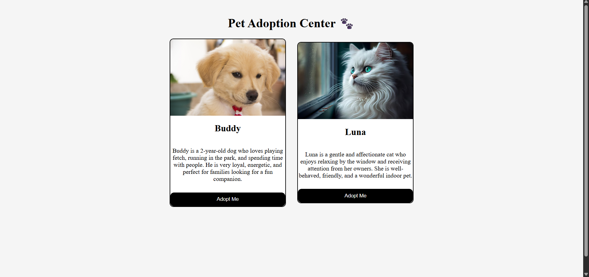

# Day 05 - Pet Adoption Page

## 📌 Project Overview

This is my Day 05 project in the **100 Days Web Development Challenge**.

I created a Pet Adoption Page using HTML and CSS. The project displays pet cards with images, descriptions, and adoption buttons in a responsive layout.

## 🚀 Technologies Used

* HTML5
* CSS3
* Flexbox
* Media Queries

## 📚 Concepts Practiced

* Flexbox Layout
* Card Design
* Hover Effects
* Box Shadow
* Border Radius
* Responsive Design
* Media Queries

## ✨ Features

* Pet Adoption Cards
* Pet Images
* Pet Descriptions
* Adopt Me Button
* Responsive Layout
* Hover Animation

## 📷 Project Screenshot

## 📂 Project Structure

Day-05-Pet-Adoption-Page

├── index.html

├── style.css

├── dog.jpg

├── cat.jpg

├── screenshot.png

└── README.md

## 💡 What I Learned

Through this project, I learned how to create responsive card layouts using Flexbox, style images and buttons, apply hover effects, and make websites adaptable to different screen sizes using Media Queries.

## 🎯 Challenge Progress

✅ Day 01 - Profile Card

✅ Day 02 - Hover Card

✅ Day 03 - Flexbox Boxes

✅ Day 04 - Flexbox Navbar

✅ Day 05 - Pet Adoption Page

## 🔥 100 Days Web Development Challenge

I am building projects daily to improve my Web Development skills and strengthen my front-end development fundamentals.

### Day 05 Completed ✅
