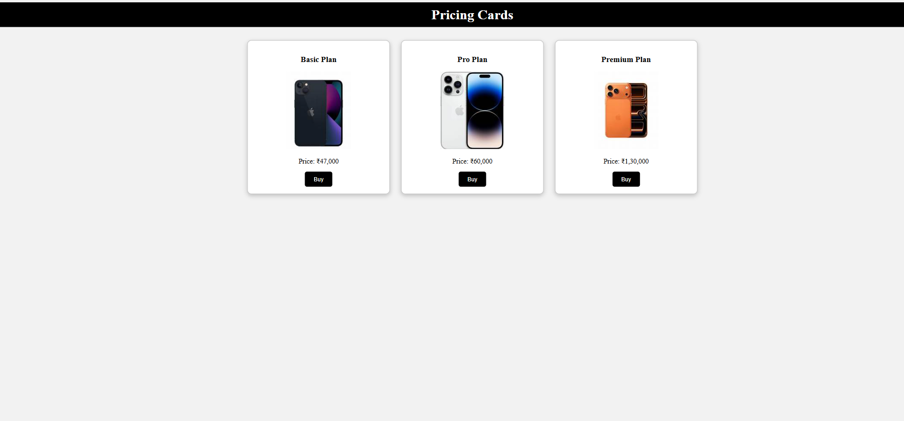

# Day 06 - Pricing Cards

## 📌 Project Overview

This is my Day 06 project in the **100 Days Web Development Challenge**.

I created a Pricing Cards section using HTML and CSS. The project displays different pricing plans with product images, descriptions, prices, and purchase buttons.

## 🚀 Technologies Used

* HTML5
* CSS3
* Flexbox

## 📚 Concepts Practiced

* Flexbox Layout
* justify-content
* flex-wrap
* gap
* Card Design
* Hover Effects
* Box Shadow
* Buttons Styling

## ✨ Features

* Three Pricing Plans
* Product Images
* Product Descriptions
* Pricing Information
* Buy Buttons
* Responsive Flexbox Layout
* Clean Card Design

## 📷 Project Screenshot

## 📂 Project Structure

Day-06-Pricing-Cards

├── index.html

├── style.css

├── Screenshot6.png

└── README.md

## 💡 What I Learned

Through this project, I learned how to:

* Create card layouts using Flexbox
* Align elements using justify-content
* Add spacing using gap
* Design responsive card sections
* Style buttons and images
* Improve layouts using hover effects

## 🎯 Challenge Progress

✅ Day 01 - Profile Card

✅ Day 02 - Hover Card

✅ Day 03 - Flexbox Boxes

✅ Day 04 - Flexbox Navbar

✅ Day 05 - Pet Adoption Page

✅ Day 06 - Pricing Cards

## 🔥 100 Days Web Development Challenge

I am building projects daily to improve my Web Development skills and strengthen my front-end development fundamentals.

### Day 06 Completed ✅

## 📬 Connect With Me

I am continuously learning Web Development and building projects every day as part of my 100 Days Challenge.
